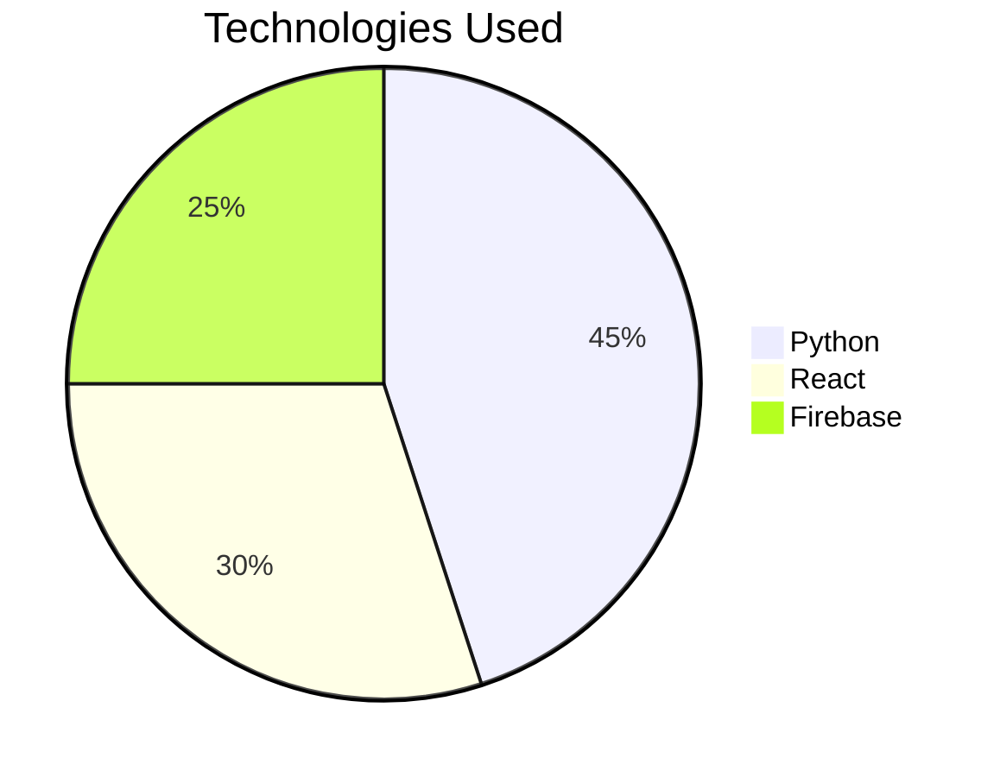

# ✨ Contribution Guide  
**Your Roadmap to Successful Collaboration**  

---

## 📌 Contributor Roles  

| Role | Responsibilities | Permissions |  
|------|------------------|-------------|  
| **Team Leaders** 🧑‍💻 | Primary code/documentation contributors | Create PRs from forks |  
| **Faculty Advisors** 👩‍🏫 | Code review, architecture guidance | Approve/request changes on PRs |  
| **Open Source Devs** 🌍 | Tooling, CI/CD, documentation improvements | Submit PRs for non-team folders |  
| **Mentors** 🏅 | Onboard new teams, resolve conflicts | Triage issues |  

---

## 🚀 Step-by-Step Contribution Process  

### 1. **Fork the Repository**  
   - Click `Fork` → Select your account  
   - *Why?* Creates your personal copy to work on  

### 2. **Clone Locally**  
   ```bash
   git clone https://github.com/YOUR_USERNAME/Mini-Projects.git
   cd Mini-Projects
   git remote add upstream https://github.com/CSE-Alpha-2022-26/Mini-Projects.git
   ```  
   - *Pro Tip:* `upstream` helps sync with the main repo  

### 3. **Create a Feature Branch**  
   ```bash
   git checkout -b TeamA_WebApp_2024
   ```  
   Naming Convention:  
   - Teams: `TeamName_Project_Year`  
   - Tools/Docs: `docs/feature-description`  

### 4. **Add Your Project**  
#### Folder Structure:  
```markdown
TeamName_Project_Year/
├── README.md          # → [Use Template Below]
├── report.pdf         # 5-10 page PDF report  
├── src/               # All source code  
│   ├── backend/       # Server-side code  
│   └── frontend/      # Client-side code  
├── docs/              # Additional documentation  
│   ├── architecture.md  
│   └── setup_guide.md  
└── LICENSE            # MIT (default)
```

#### Required Files Checklist:  
- [ ] `README.md` with team details  
- [ ] Report (PDF preferred)  
- [ ] Functional code in `src/`  
- [ ] Empty `.gitkeep` files in empty dirs  

### 5. **Commit Changes**  
```bash
git add .
git commit -m "feat: Add EcoTrack project by TeamA

- Implemented sustainability dashboard 
- Added API documentation
- Includes test cases"
```  
*Follow [Conventional Commits](https://www.conventionalcommits.org/):*  
- `feat:` New functionality  
- `fix:` Bug corrections  
- `docs:` Documentation changes  

### 6. **Sync with Upstream**  
```bash
git fetch upstream
git rebase upstream/main
```  
*Avoids merge conflicts before PR*  

### 7. **Push & Create PR**  
```bash
git push origin TeamA_WebApp_2024
```  
Then:  
1. Go to your fork on GitHub  
2. Click `Compare & Pull Request`  
3. Use the [PR Template](#-pull-request-template)  

---

## ✅ Project README Template  
```markdown
# 🚀 Project Title - Team Name (Year)  

## 👥 Team Members  
| Name            | Role           | GitHub Handle |  
|-----------------|----------------|---------------|  
| Alice Thomas    | Backend Dev    | @alice-thomas |  
| Bob Jacob       | UI/UX          | @bobjacob-dev |  

## 📌 Abstract  
A 2-3 paragraph explanation covering:  
- Problem statement  
- Your solution  
- Key innovations  

## 🛠 Tech Stack  


## 🏗 Architecture  
```bash
src/
├── backend/       # Django API
├── frontend/      # React SPA
└── tests/         # Pytest suites
```

## 🚀 Setup Guide  
### Local Development  
```bash
python -m venv venv
source venv/bin/activate
pip install -r requirements.txt
```

## 📄 License  
MIT Licensed. See [LICENSE](LICENSE).  

## 🔍 Pull Request Template  
```markdown
## Related Issue  
Fixes #123  

## Changes Proposed  
- [x] Added authentication module  
- [ ] Needs documentation update  

## Screenshots  
| Before | After |  
|--------|-------|  
|  |  |  

## Checklist  
- [ ] Code linted with `pylint`  
- [ ] All tests pass (`pytest`)  
- [ ] Documentation updated  
```

---

## 🛡 Code of Conduct  
All contributors must adhere to:  
1. **Respectful Communication**  
   - No offensive language  
   - Constructive criticism only  
2. **Inclusivity**  
   - Welcome all skill levels  
   - Accommodate learning curves  
3. **Academic Integrity**  
   - No plagiarized code  
   - Cite external resources  

*Violations may result in revoked commit privileges.*  

---

## 💡 Pro Tips  
1. **Sync Frequently**  
   ```bash
   git fetch upstream
   git merge upstream/main
   ```  
2. **Use Issues**  
   - Tag with `bug`, `enhancement`, or `question`  
3. **Atomic Commits**  
   - One feature/bugfix per commit  

Need help? Mention `@mentors` in issues!  

--- 

*Last Updated: 2024-07-20*  

--- 
